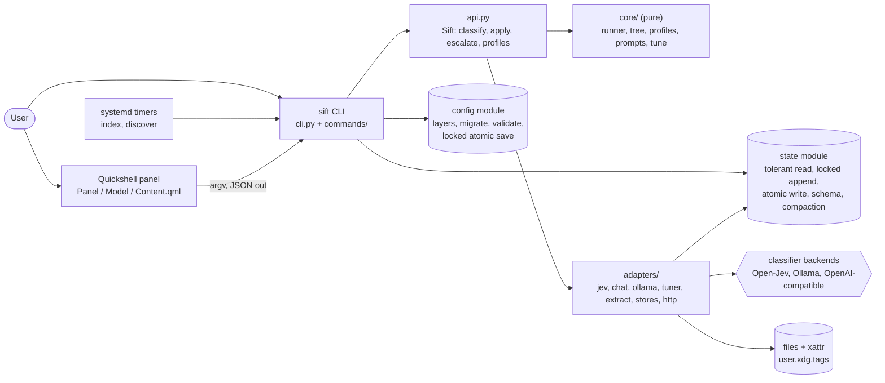
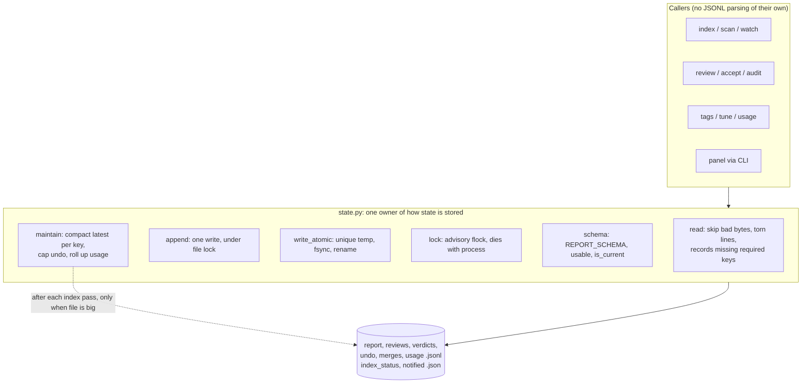
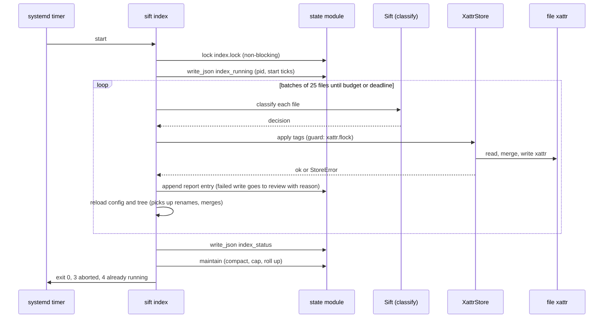

# Architecture

How Sift is put together after the publication hardening (ADR-0013). Commands live in `sift/commands/` (`scanning`, `review`, `research` and the registry modules); `cli.py` is the parser and dispatch. Decisions are in [adr/](adr/); this page is the picture.

## Containers

## The state module

Every rule about how state is stored lives in `state.py`. Nothing else parses JSONL or writes a file its own way.

## An index run

